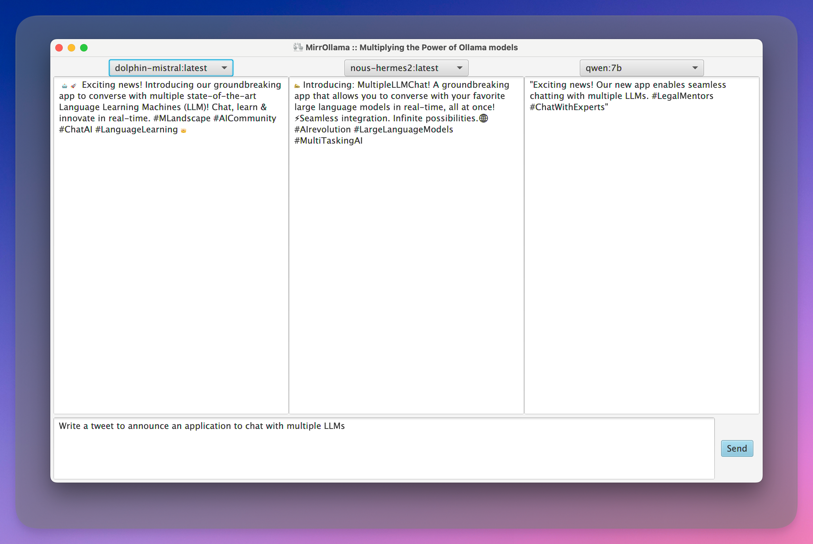

<p align="center">
  
</p>
<h1 align="center">MirrOllama :: Multiplying the Power of Ollama models</h1>  

#### Features



#### Development

You'll need Java17 and JavaFX to build and run this application.
The easiest way is to use [SDKMAN](https://sdkman.io/).

Once you have SDKMAN installed, you can install `17.0.5-tem`.

```shell
sdk install java 17.0.5-tem
```

Once it is installed, just run the following command to build the application.

```shell
make run 
```  

You can just run `make` to display list of available commands.

```shell
make
```

### Packaging

```shell
make install
```

### Icons

Requires Inkscape and ImageMagick.

```shell
brew install imagemagick
brew install cask inkscape
```

Run the following command to generate icons for all platforms.

```shell
make icons
```
